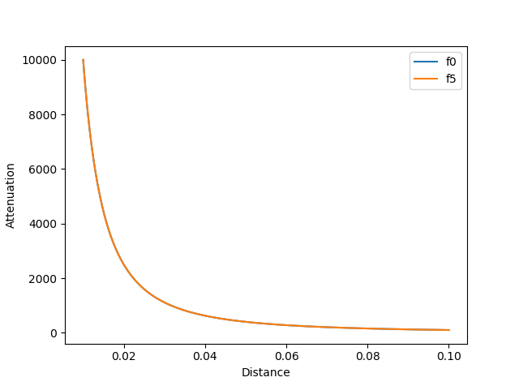
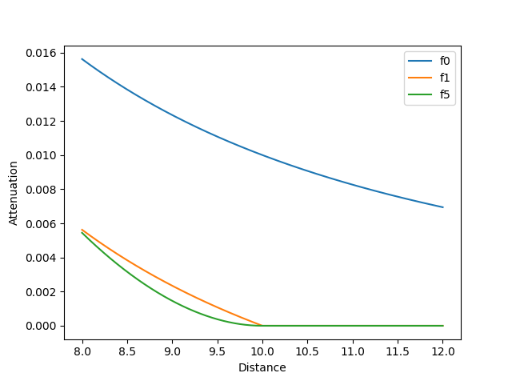
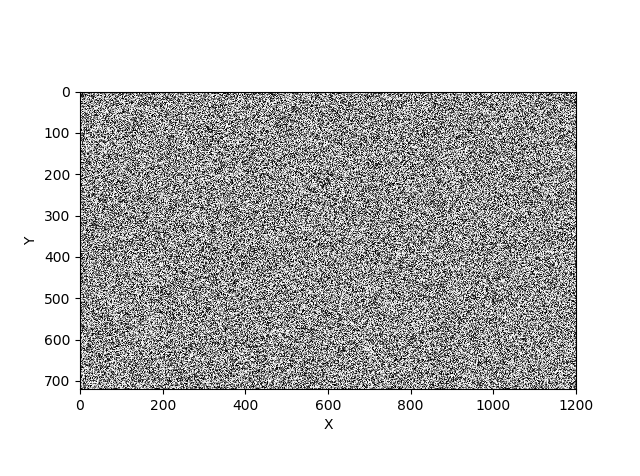
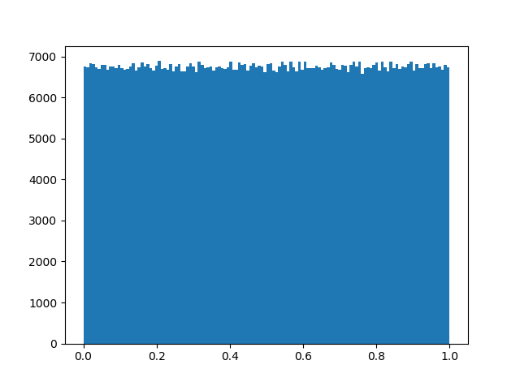
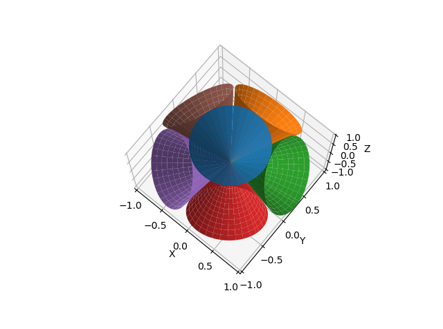

[![Code quality][s1]][co] [![License][s2]][li]

[s1]: https://api.codacy.com/project/badge/Grade/821eda431c4d4375ac5013847d305495
[s2]: https://img.shields.io/badge/licence-GPL%203.0-blue.svg

[co]: https://www.codacy.com/app/matt77hias/PipelineExperiments?utm_source=github.com&amp;utm_medium=referral&amp;utm_content=matt77hias/PipelineExperiments&amp;utm_campaign=Badge_Grad
[li]: https://raw.githubusercontent.com/matt77hias/PipelineExperiments/master/LICENSE.txt

# PipelineExperiments

## About
Rendering Pipeline Experiments

### [BRDFs](https://github.com/matt77hias/PipelineExperiments/blob/master/src/brdf.py)
Various BRDF functions and components.

### [Distance Attenuation](https://github.com/matt77hias/PipelineExperiments/blob/master/src/distance_attenuation.py)
Various distance attenuation functions for point lights (omni lights and spotlights).

### [Dither](https://github.com/matt77hias/PipelineExperiments/blob/master/src/dither.py)
Various noise functions, hashing functions and random number generators for dithering.

## [Voxel Cone Tracing](https://github.com/matt77hias/PipelineExperiments/blob/master/src/vct_diffuse.py)
Cone sampling and cone weights.

## See also

[MAGE - Matthias Advanced Game Engine](https://github.com/matt77hias/MAGE)

| Libraries                                          | Description                                                        |
|----------------------------------------------------|--------------------------------------------------------------------|
| [basispy](https://github.com/matt77hias/basispy)   | Utilities for calculating (orthonormal) bases                      |
| [Clipping](https://github.com/matt77hias/Clipping) | Clipping utilities                                                 |
| [ffpy](https://github.com/matt77hias/ffpy)         | Formfactor utilities                                               |
| [fibpy](https://github.com/matt77hias/fibpy)       | Fibonacci spiral sampling (Quasi-Monte Carlo techniques) utilities |
| [sampy](https://github.com/matt77hias/sampy)       | Sampling utilities                                                 |
